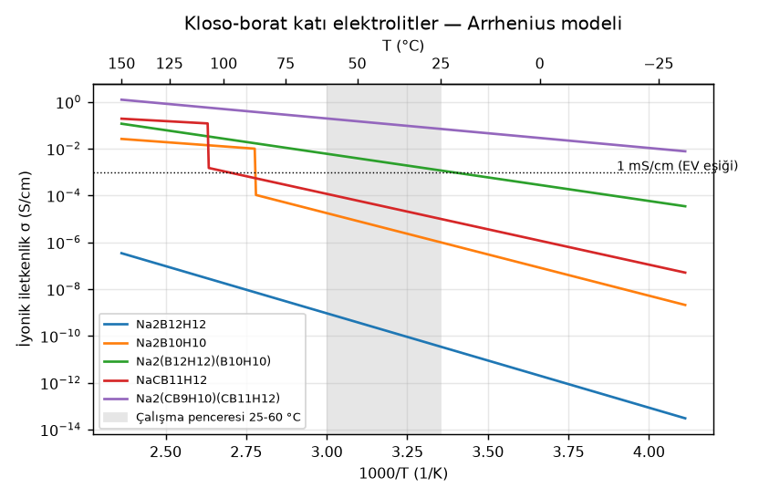
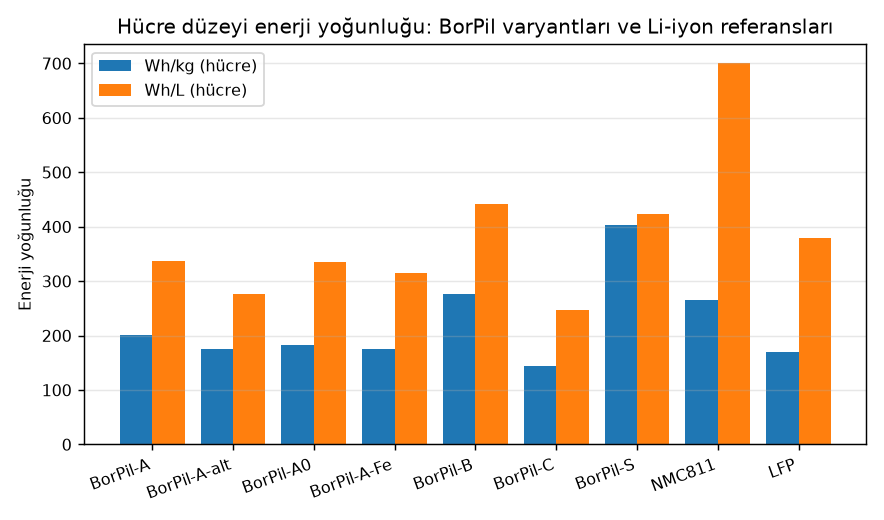
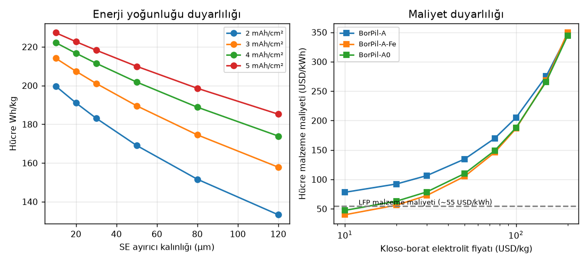
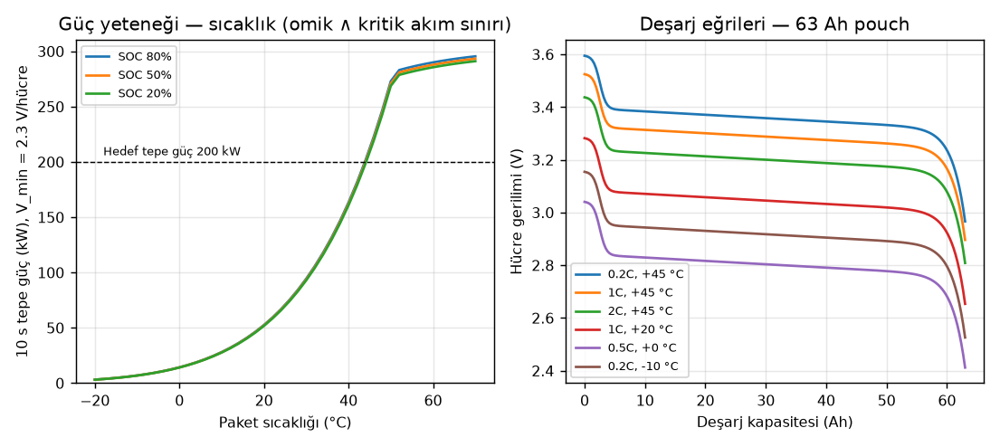
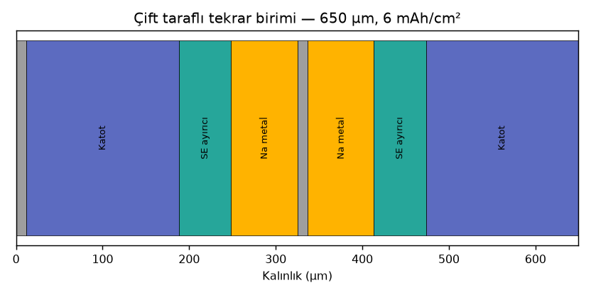
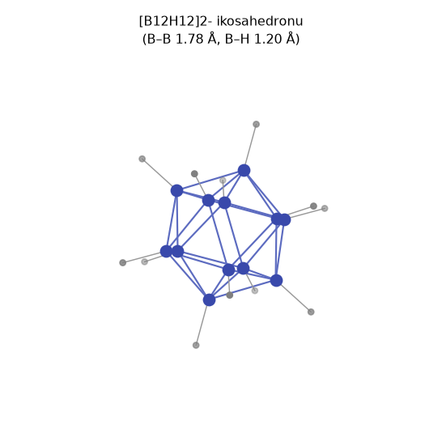

# BorPil — Hesaplanmış Tasarım Raporu (otomatik üretildi)

Bu dosya `borpil rapor` komutuyla üretilir; tüm sayılar `borpil` paketindeki modellerden gelir.

## 1. Teorik sınırlar (termodinamik)

| Kimya | Reaksiyon | E° (V) | Kapasite (mAh/g reaktan) | Wh/kg reaktan | Wh/kg ürün (O₂ dâhil) |
|---|---|---:|---:|---:|---:|
| Bor-hava (teorik) | 4B + 3O2 → 2B2O3 | 2.063 | 7438 | 15345 | 4765 |
| Li-hava (Li2O) | 4Li + O2 → 2Li2O | 2.908 | 3862 | 11231 | 5217 |
| Na-hava (Na2O) | 4Na + O2 → 2Na2O | 1.946 | 1166 | 2268 | 1683 |
| Mg-hava (MgO) | 2Mg + O2 → 2MgO | 2.950 | 2205 | 6506 | 3924 |
| Doğrudan borhidrür yakıt pili (DBFC, teorik) | NaBH4 + 2O2 → NaBO2 + 2H2O | 1.647 | 5667 | 9333 | 3467 |

DBFC pratik tahmin: %20 NaBH₄ çözeltisi, 0.85 V, %65 yakıt kullanımı → 626 Wh/kg çözelti, 391 Wh/kg sistem; NaBO₂→NaBH₄ rejenerasyonu dâhil gidiş-dönüş verimi **%10** (rejenerasyon verimi %30 varsayımı). Sonuç: DBFC ana depolama değil, menzil uzatıcı/yakıt yoludur.

DBFC menzil uzatıcı örneği: 40 kg çözelti (8 kg NaBH₄) + 15 kW yığın + tank/BOP = 160 kg → 25 kWh, **+167 km** (157 Wh/kg sistem), ~3 dk sıvı dolum.

## 2. Elektrolit: kloso-borat iletkenliği

| Elektrolit | σ(−10 °C) mS/cm | σ(25 °C) | σ(45 °C) | σ(60 °C) | Ea (eV) | ASR 30 µm @45 °C (Ω·cm²) |
|---|---:|---:|---:|---:|---:|---:|
| Na2B12H12 | 5.52e-10 | 3.47e-08 | 2.46e-07 | 9.15e-07 | 0.80 | 12195110.05 |
| Na2B10H10 | 2.67e-05 | 0.001 | 0.00554 | 0.0175 | 0.70 | 541.12 |
| Na2(B12H12)(B10H10) | 0.148 | 1.17 | 3.12 | 6.02 | 0.40 | 0.96 |
| NaCB11H12 | 0.000448 | 0.01 | 0.0434 | 0.116 | 0.60 | 69.11 |
| Na2(CB9H10)(CB11H12) | 19.2 | 70 | 129 | 195 | 0.25 | 0.02 |

Geometri: [B12H12]2-: kenar 1.78 Å, R_B 1.69 Å, R_H 2.89 Å, etkin yarıçap 3.99 Å, etkin hacim 267 ų. Süperiyonik bcc Na₂B₁₂H₁₂ kafesi a = 7.90 Å; anyon sert-küre yarıçapı 3.42 Å; tetrahedral site boşluk yarıçapı 1.00 Å (Na⁺ 1.02 Å); Na site doluluğu 0.33 → yüksek vakans oranı.

## 3. Hücre varyantları

```
== BorPil-A (Na | Na2(B12H12)(B10H10) | NVP) ==
Katot: Na3V2(PO4)3 (NASICON, NVP) | SE: Na2(B12H12)0.5(B10H10)0.5 (eş-molar kloso-borat karışımı) | Anot: Na metal
Çalışma sıcaklığı 45 °C → σ = 3.12 mS/cm, toplam ASR ≈ 29.2 Ω·cm²
Katmanlar (tekrar birimi):
  - Al folyo (katot)                12.0 µm     3.24 mg/cm²
  - Katot kompozit                 179.7 µm    38.96 mg/cm²
  - SE ayırıcı                      30.0 µm     4.50 mg/cm²
  - Na metal anot (fazlalık; şarjlı kalınlık)    46.5 µm     1.94 mg/cm²
  - Al folyo (anot)                 12.0 µm     3.24 mg/cm²
  - Na metal anot (fazlalık; şarjlı kalınlık)    46.5 µm     1.94 mg/cm²
  - SE ayırıcı                      30.0 µm     4.50 mg/cm²
  - Katot kompozit                 179.7 µm    38.96 mg/cm²
Tekrar birimi: 536 µm, 97.3 mg/cm², 6.0 mAh/cm², 3.37 V
Yığın: 208 Wh/kg, 377 Wh/L
Hücre (100×300 mm pouch, 33 birim): 59.4 Ah, 995 g, 594 mL → 201 Wh/kg, 337 Wh/L
Element bütçesi: B 0.95 kg/kWh, Na 0.97 kg/kWh, V 0.60 kg/kWh, Li 0.00 kg/kWh
Malzeme maliyeti (varsayımsal ölçek): 134 USD/kWh
  ! UYARI: katot kesim potansiyeli ~3.8 V termodinamik oksidasyon sınırının (3.0 V) üstünde; çalışma pasifleştirici arayüze (kaplama) dayanır.
```

```
== BorPil-A-alt (Na | Na2(B12H12)(B10H10) | NVP) — muhafazakâr alt tahmin (60 µm SE, 50 µm Na, 30 Ω·cm²) ==
Katot: Na3V2(PO4)3 (NASICON, NVP) | SE: Na2(B12H12)0.5(B10H10)0.5 (eş-molar kloso-borat karışımı) | Anot: Na metal
Çalışma sıcaklığı 45 °C → σ = 3.12 mS/cm, toplam ASR ≈ 45.2 Ω·cm²
Katmanlar (tekrar birimi):
  - Al folyo (katot)                12.0 µm     3.24 mg/cm²
  - Katot kompozit                 179.7 µm    38.96 mg/cm²
  - SE ayırıcı                      60.0 µm     9.00 mg/cm²
  - Na metal anot (fazlalık; şarjlı kalınlık)    76.5 µm     4.85 mg/cm²
  - Al folyo (anot)                 12.0 µm     3.24 mg/cm²
  - Na metal anot (fazlalık; şarjlı kalınlık)    76.5 µm     4.85 mg/cm²
  - SE ayırıcı                      60.0 µm     9.00 mg/cm²
  - Katot kompozit                 179.7 µm    38.96 mg/cm²
Tekrar birimi: 656 µm, 112.1 mg/cm², 6.0 mAh/cm², 3.37 V
Yığın: 180 Wh/kg, 308 Wh/L
Hücre (100×300 mm pouch, 33 birim): 59.4 Ah, 1145 g, 725 mL → 175 Wh/kg, 276 Wh/L
Element bütçesi: B 1.25 kg/kWh, Na 1.37 kg/kWh, V 0.60 kg/kWh, Li 0.00 kg/kWh
Malzeme maliyeti (varsayımsal ölçek): 158 USD/kWh
  ! UYARI: katot kesim potansiyeli ~3.8 V termodinamik oksidasyon sınırının (3.0 V) üstünde; çalışma pasifleştirici arayüze (kaplama) dayanır.
```

```
== BorPil-A0 (Na | Na2(B12H12)(B10H10) | NaCrO2) — pencere içi muhafazakâr ==
Katot: NaCrO2 (O3 tabakalı oksit) | SE: Na2(B12H12)0.5(B10H10)0.5 (eş-molar kloso-borat karışımı) | Anot: Na metal
Çalışma sıcaklığı 45 °C → σ = 3.12 mS/cm, toplam ASR ≈ 24.6 Ω·cm²
Katmanlar (tekrar birimi):
  - Al folyo (katot)                12.0 µm     3.24 mg/cm²
  - Katot kompozit                 147.4 µm    37.27 mg/cm²
  - SE ayırıcı                      30.0 µm     4.50 mg/cm²
  - Na metal anot (fazlalık; şarjlı kalınlık)    46.5 µm     1.94 mg/cm²
  - Al folyo (anot)                 12.0 µm     3.24 mg/cm²
  - Na metal anot (fazlalık; şarjlı kalınlık)    46.5 µm     1.94 mg/cm²
  - SE ayırıcı                      30.0 µm     4.50 mg/cm²
  - Katot kompozit                 147.4 µm    37.27 mg/cm²
Tekrar birimi: 472 µm, 93.9 mg/cm², 6.0 mAh/cm², 2.95 V
Yığın: 189 Wh/kg, 375 Wh/L
Hücre (100×300 mm pouch, 33 birim): 59.4 Ah, 961 g, 524 mL → 182 Wh/kg, 335 Wh/L
Element bütçesi: B 1.05 kg/kWh, Na 1.26 kg/kWh, V 0.00 kg/kWh, Li 0.00 kg/kWh
Malzeme maliyeti (varsayımsal ölçek): 110 USD/kWh
  ! UYARI: katot kesim potansiyeli ~3.4 V termodinamik oksidasyon sınırının (3.0 V) üstünde; çalışma pasifleştirici arayüze (kaplama) dayanır.
```

```
== BorPil-A-Fe (Na | Na2(B12H12)(B10H10) | Na2/3Fe1/2Mn1/2O2) — vanadyumsuz düşük maliyet ==
Katot: P2-Na2/3Fe1/2Mn1/2O2 (tabakalı Fe/Mn oksit) | SE: Na2(B12H12)0.5(B10H10)0.5 (eş-molar kloso-borat karışımı) | Anot: Na metal
Çalışma sıcaklığı 45 °C → σ = 3.12 mS/cm, toplam ASR ≈ 24.8 Ω·cm²
Katmanlar (tekrar birimi):
  - Al folyo (katot)                12.0 µm     3.24 mg/cm²
  - Katot kompozit                 145.2 µm    35.71 mg/cm²
  - SE ayırıcı                      30.0 µm     4.50 mg/cm²
  - Na metal anot (fazlalık; şarjlı kalınlık)    46.5 µm     1.94 mg/cm²
  - Al folyo (anot)                 12.0 µm     3.24 mg/cm²
  - Na metal anot (fazlalık; şarjlı kalınlık)    46.5 µm     1.94 mg/cm²
  - SE ayırıcı                      30.0 µm     4.50 mg/cm²
  - Katot kompozit                 145.2 µm    35.71 mg/cm²
Tekrar birimi: 468 µm, 90.8 mg/cm², 6.0 mAh/cm², 2.75 V
Yığın: 182 Wh/kg, 353 Wh/L
Hücre (100×300 mm pouch, 33 birim): 59.4 Ah, 930 g, 519 mL → 176 Wh/kg, 315 Wh/L
Element bütçesi: B 1.10 kg/kWh, Na 1.11 kg/kWh, V 0.00 kg/kWh, Li 0.00 kg/kWh
Malzeme maliyeti (varsayımsal ölçek): 105 USD/kWh
  ! UYARI: katot kesim potansiyeli ~3.1 V termodinamik oksidasyon sınırının (3.0 V) üstünde; çalışma pasifleştirici arayüze (kaplama) dayanır.
```

```
== BorPil-B (Na | Na2(CB9H10)(CB11H12) | NVPF) — 2. nesil yüksek performans ==
Katot: Na3V2(PO4)2F3 (NVPF) | SE: Na2(CB9H10)(CB11H12) (karışık karba-kloso-borat) | Anot: Na metal
Çalışma sıcaklığı 35 °C → σ = 95.99 mS/cm, toplam ASR ≈ 8.5 Ω·cm²
Katmanlar (tekrar birimi):
  - Al folyo (katot)                12.0 µm     3.24 mg/cm²
  - Katot kompozit                 237.6 µm    47.62 mg/cm²
  - SE ayırıcı                      20.0 µm     2.50 mg/cm²
  - Na metal anot (fazlalık; şarjlı kalınlık)    45.4 µm     0.97 mg/cm²
  - Al folyo (anot)                 12.0 µm     3.24 mg/cm²
  - Na metal anot (fazlalık; şarjlı kalınlık)    45.4 µm     0.97 mg/cm²
  - SE ayırıcı                      20.0 µm     2.50 mg/cm²
  - Katot kompozit                 237.6 µm    47.62 mg/cm²
Tekrar birimi: 630 µm, 108.7 mg/cm², 8.0 mAh/cm², 3.90 V
Yığın: 287 Wh/kg, 495 Wh/L
Hücre (100×300 mm pouch, 25 birim): 60.0 Ah, 844 g, 530 mL → 277 Wh/kg, 442 Wh/L
Element bütçesi: B 0.65 kg/kWh, Na 0.55 kg/kWh, V 0.52 kg/kWh, Li 0.00 kg/kWh
Malzeme maliyeti (varsayımsal ölçek): 457 USD/kWh
  ! KRİTİK: katot kesim potansiyeli ~4.3 V, elektrolitin pasifleşmeyle ulaştığı sınırı (4.2 V) aşıyor.
```

```
== BorPil-C (Sert karbon | Na2(B12H12)(B10H10) | NVP) — dendritsiz güvenli varyant ==
Katot: Na3V2(PO4)3 (NASICON, NVP) | SE: Na2(B12H12)0.5(B10H10)0.5 (eş-molar kloso-borat karışımı) | Anot: Sert karbon (hard carbon)
Çalışma sıcaklığı 45 °C → σ = 3.12 mS/cm, toplam ASR ≈ 29.2 Ω·cm²
Katmanlar (tekrar birimi):
  - Al folyo (katot)                12.0 µm     3.24 mg/cm²
  - Katot kompozit                 179.7 µm    38.96 mg/cm²
  - SE ayırıcı                      30.0 µm     4.50 mg/cm²
  - Sert karbon (hard carbon) kompozit anot   123.5 µm    17.33 mg/cm²
  - Al folyo (anot)                 12.0 µm     3.24 mg/cm²
  - Sert karbon (hard carbon) kompozit anot   123.5 µm    17.33 mg/cm²
  - SE ayırıcı                      30.0 µm     4.50 mg/cm²
  - Katot kompozit                 179.7 µm    38.96 mg/cm²
Tekrar birimi: 690 µm, 128.1 mg/cm², 6.0 mAh/cm², 3.17 V
Yığın: 149 Wh/kg, 276 Wh/L
Hücre (100×300 mm pouch, 33 birim): 59.4 Ah, 1306 g, 762 mL → 144 Wh/kg, 247 Wh/L
Element bütçesi: B 1.34 kg/kWh, Na 0.95 kg/kWh, V 0.64 kg/kWh, Li 0.00 kg/kWh
Malzeme maliyeti (varsayımsal ölçek): 178 USD/kWh
  ! UYARI: katot kesim potansiyeli ~3.8 V termodinamik oksidasyon sınırının (3.0 V) üstünde; çalışma pasifleştirici arayüze (kaplama) dayanır.
```

```
== BorPil-S (Na | Na2(CB9H10)(CB11H12) | S) — uzun vade Na-S ==
Katot: S (Na-S, Na2S'e kadar) | SE: Na2(CB9H10)(CB11H12) (karışık karba-kloso-borat) | Anot: Na metal
Çalışma sıcaklığı 60 °C → σ = 194.56 mS/cm, toplam ASR ≈ 20.1 Ω·cm²
Katmanlar (tekrar birimi):
  - Al folyo (katot)                12.0 µm     3.24 mg/cm²
  - Katot kompozit                  71.6 µm    10.00 mg/cm²
  - SE ayırıcı                      20.0 µm     2.50 mg/cm²
  - Na metal anot (fazlalık; şarjlı kalınlık)    45.4 µm     0.97 mg/cm²
  - Al folyo (anot)                 12.0 µm     3.24 mg/cm²
  - Na metal anot (fazlalık; şarjlı kalınlık)    45.4 µm     0.97 mg/cm²
  - SE ayırıcı                      20.0 µm     2.50 mg/cm²
  - Katot kompozit                  71.6 µm    10.00 mg/cm²
Tekrar birimi: 298 µm, 33.4 mg/cm², 8.0 mAh/cm², 1.80 V
Yığın: 431 Wh/kg, 483 Wh/L
Hücre (100×300 mm pouch, 25 birim): 60.0 Ah, 268 g, 256 mL → 402 Wh/kg, 422 Wh/L
Element bütçesi: B 0.58 kg/kWh, Na 0.26 kg/kWh, V 0.00 kg/kWh, Li 0.00 kg/kWh
Malzeme maliyeti (varsayımsal ölçek): 381 USD/kWh
```

## 4. Paket (BorPil-A, 75 kWh, 400 V)

```
== Paket: C-segment sedan/SUV — 75 kWh hedef, 400 V ==
Hücre: BorPil-A (Na | Na2(B12H12)(B10H10) | NVP)
Mimari: 119s3p = 357 hücre × 63.0 Ah, 401 V nominal
Enerji: 75.8 kWh brüt / 69.7 kWh kullanılabilir
Kütle 523 kg (145 Wh/kg), hacim 401 L (189 Wh/L)
Element bütçesi: B 72.1 kg, Na 73.4 kg, V 45.7 kg, Li 0.0 kg
Akım yoğunluğu: sürekli 3.17 mA/cm², tepe 7.92 mA/cm²
Isıl: kayıp 10.1 W/K (ΔT=40 K → 403 W); -10→25 °C ön ısıtma 5.1 kWh
Maliyet (varsayımsal ölçek): 17,464 USD → 230 USD/kWh
```

## 5. Sürüş simülasyonu (WLTP-benzeri sentetik çevrim, C-segment)

| Senaryo | Menzil (km) | Tüketim (kWh/100 km) | Paket T başlangıç→bitiş (°C) | Min hücre gerilimi (V) | Ort. I²R ısı (W) | Isıtıcı (kWh) | Güç kısıtı (s) / açık (kWh) |
|---|---:|---:|---:|---:|---:|---:|---:|
| 20 °C, ısıtıcı hedef 35 °C (tasarım stratejisi) | 476 | 14.7 | 20→35 | 3.22 | 92 | 2.7 | 0 / 0.00 |
| 20 °C, ısıtıcı kapalı | 490 | 14.2 | 20→28 | 3.17 | 159 | 0.0 | 0 / 0.00 |
| −10 °C, ısıtıcı hedef 35 °C (6 kW) | 428 | 16.3 | -10→35 | 2.87 | 153 | 9.0 | 0 / 0.00 |
| −20 °C, ısıtıcı kapalı (stres senaryosu) | 454 | 15.4 | -20→12 | 2.36 | 735 | 0.0 | 427 / 1.07 |
| 35 °C | 495 | 14.1 | 35→39 | 3.25 | 79 | 0.0 | 0 / 0.00 |

Araç toplam kütlesi 2023 kg (glider + yük + paket). Tüketim, bataryadan çekilen toplam enerjiyi (ısıtıcı dâhil, şarj kayıpları hariç) içerir; uç enerjisi ∫V·I dt = 69.1 kWh (kullanılan 69.7 kWh, fark I²R kaybı).

## 6. Li-iyon ile karşılaştırma (75 kWh paket)

| Kimya | Wh/kg (hücre) | Wh/L (hücre) | USD/kWh (hücre, varsayım) | Li (kg/75 kWh) | B (kg) | Co (kg) | Ni (kg) | Yanıcı elektrolit | Paket kütlesi (kg) | Paket hacmi (L) |
|---|---:|---:|---:|---:|---:|---:|---:|:--:|---:|---:|
| BorPil-A | 201 | 337 | 208 | 0.0 | 72.1 | 0.0 | 0.0 | hayır | 523 | 401 |
| BorPil-A-alt | 175 | 276 | 244 | 0.0 | 94.9 | 0.0 | 0.0 | hayır | 602 | 490 |
| BorPil-A0 | 182 | 335 | 170 | 0.0 | 80.0 | 0.0 | 0.0 | hayır | 577 | 404 |
| BorPil-A-Fe | 176 | 315 | 163 | 0.0 | 82.9 | 0.0 | 0.0 | hayır | 595 | 427 |
| BorPil-B | 277 | 442 | 709 | 0.0 | 48.7 | 0.0 | 0.0 | hayır | 377 | 304 |
| BorPil-C | 144 | 247 | 276 | 0.0 | 101.5 | 0.0 | 0.0 | hayır | 727 | 545 |
| BorPil-S | 403 | 423 | 591 | 0.0 | 43.7 | 0.0 | 0.0 | hayır | 258 | 316 |
| Li-iyon NMC811 (pouch, 2025 sınıfı) | 265 | 700 | 100 | 8.2 | 0.0 | 6.8 | 56.2 | evet | 393 | 179 |
| Li-iyon LFP (prizmatik, 2025 sınıfı) | 170 | 380 | 75 | 6.8 | 0.0 | 0.0 | 0.0 | evet | 613 | 329 |

## 7. Grafikler












