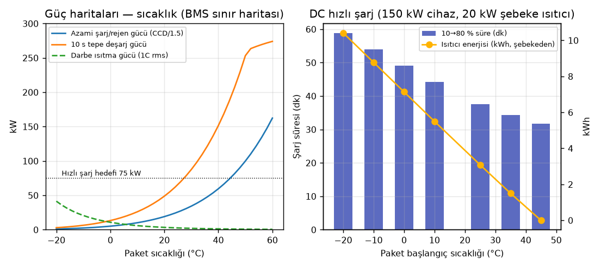
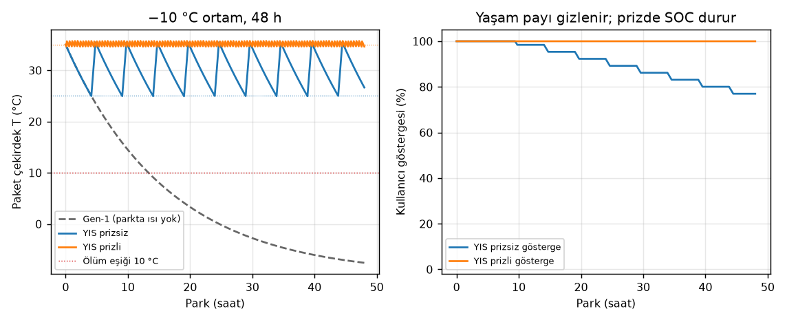

# BorPil — Hesaplanmış Tasarım Raporu (otomatik üretildi)

Bu dosya `borpil rapor` komutuyla üretilir; tüm sayılar `borpil` paketindeki modellerden gelir. Kurul kararı (docs/07): 1. nesil ticari **baz çizgisi BorPil-A-alt**, **hedef/üst bant BorPil-A**; her iki konfigürasyon yan yana raporlanır.

## 1. Teorik sınırlar (termodinamik)

| Kimya | Reaksiyon | E° (V) | Kapasite (mAh/g reaktan) | Wh/kg reaktan | Wh/kg ürün (O₂ dâhil) |
|---|---|---:|---:|---:|---:|
| Bor-hava (teorik) | 4B + 3O2 → 2B2O3 | 2.063 | 7438 | 15345 | 4765 |
| Li-hava (Li2O) | 4Li + O2 → 2Li2O | 2.908 | 3862 | 11231 | 5217 |
| Na-hava (Na2O) | 4Na + O2 → 2Na2O | 1.946 | 1166 | 2268 | 1683 |
| Mg-hava (MgO) | 2Mg + O2 → 2MgO | 2.950 | 2205 | 6506 | 3924 |
| Doğrudan borhidrür yakıt pili (DBFC, teorik) | NaBH4 + 2O2 → NaBO2 + 2H2O | 1.647 | 5667 | 9333 | 3467 |

DBFC pratik tahmin: %20 NaBH₄ çözeltisi, 0.85 V, %65 yakıt kullanımı → 626 Wh/kg çözelti, 391 Wh/kg sistem; NaBO₂→NaBH₄ rejenerasyonu dâhil gidiş-dönüş verimi **%10** (rejenerasyon verimi %30 varsayımı). Sonuç: DBFC ana depolama değil, menzil uzatıcı/yakıt yoludur.

DBFC menzil uzatıcı örneği: 40 kg çözelti (8 kg NaBH₄) + 15 kW yığın + tank/BOP = 160 kg → 25 kWh, **+167 km** (157 Wh/kg sistem), ~3 dk sıvı dolum.

## 2. Elektrolit: kloso-borat iletkenliği

| Elektrolit | σ(−10 °C) mS/cm | σ(25 °C) | σ(45 °C) | σ(60 °C) | Ea (eV) | ASR 30 µm @45 °C (Ω·cm²) |
|---|---:|---:|---:|---:|---:|---:|
| Na2B12H12 | 5.52e-10 | 3.47e-08 | 2.46e-07 | 9.15e-07 | 0.80 | 1.22e+07 |
| Na2B10H10 | 2.67e-05 | 0.001 | 0.00554 | 0.0175 | 0.70 | 541 |
| Na2(B12H12)(B10H10) | 0.148 | 1.17 | 3.12 | 6.02 | 0.40 | 0.961 |
| NaCB11H12 | 0.000448 | 0.01 | 0.0434 | 0.116 | 0.60 | 69.1 |
| Na2(CB9H10)(CB11H12) | 19.2 | 70 | 129 | 195 | 0.25 | 0.0232 |

Geometri: [B12H12]2-: kenar 1.78 Å, R_B 1.69 Å, R_H 2.89 Å, etkin yarıçap 3.99 Å, etkin hacim 267 ų. Süperiyonik bcc Na₂B₁₂H₁₂ kafesi a = 7.90 Å; anyon sert-küre yarıçapı 3.42 Å; tetrahedral site boşluk yarıçapı 1.00 Å (Na⁺ 1.02 Å); Na site doluluğu 0.33 → yüksek vakans oranı.

## 3. Hücre varyantları

```
== BorPil-A (Na | Na2(B12H12)(B10H10) | NVP) — 1. nesil hedef / üst bant ==
Katot: Na3V2(PO4)3 (NASICON, NVP) | SE: Na2(B12H12)0.5(B10H10)0.5 (eş-molar kloso-borat karışımı) | Anot: Na metal
Çalışma sıcaklığı 45 °C → σ = 3.12 mS/cm, toplam ASR ≈ 28.9 Ω·cm²
Katmanlar (tekrar birimi):
  - Al folyo (katot)                12.0 µm     3.24 mg/cm²
  - Katot kompozit                 176.4 µm    38.41 mg/cm²
  - SE ayırıcı                      30.0 µm     4.50 mg/cm²
  - Na metal anot (fazlalık; şarjlı kalınlık)    46.5 µm     1.94 mg/cm²
  - Al folyo (anot)                 12.0 µm     3.24 mg/cm²
  - Na metal anot (fazlalık; şarjlı kalınlık)    46.5 µm     1.94 mg/cm²
  - SE ayırıcı                      30.0 µm     4.50 mg/cm²
  - Katot kompozit                 176.4 µm    38.41 mg/cm²
Tekrar birimi: 530 µm, 96.2 mg/cm², 6.0 mAh/cm², 3.37 V
Yığın: 210 Wh/kg, 382 Wh/L
Hücre (100×300 mm pouch, 33 birim): 59.4 Ah, 984 g, 587 mL → 203 Wh/kg, 341 Wh/L
Element bütçesi: B 0.94 kg/kWh, Na 0.96 kg/kWh, V 0.60 kg/kWh, Li 0.00 kg/kWh
Malzeme maliyeti (varsayımsal ölçek): 139 USD/kWh
  ! UYARI: katot kesim potansiyeli ~3.8 V termodinamik oksidasyon sınırının (3.0 V) üstünde; çalışma pasifleştirici arayüze (kaplama) dayanır.
```

```
== BorPil-A-alt (Na | Na2(B12H12)(B10H10) | NVP) — 1. nesil TİCARİ BAZ ÇİZGİSİ (60 µm SE, 50 µm Na, 30 Ω·cm²) ==
Katot: Na3V2(PO4)3 (NASICON, NVP) | SE: Na2(B12H12)0.5(B10H10)0.5 (eş-molar kloso-borat karışımı) | Anot: Na metal
Çalışma sıcaklığı 45 °C → σ = 3.12 mS/cm, toplam ASR ≈ 44.8 Ω·cm²
Katmanlar (tekrar birimi):
  - Al folyo (katot)                12.0 µm     3.24 mg/cm²
  - Katot kompozit                 176.4 µm    38.41 mg/cm²
  - SE ayırıcı                      60.0 µm     9.00 mg/cm²
  - Na metal anot (fazlalık; şarjlı kalınlık)    76.5 µm     4.85 mg/cm²
  - Al folyo (anot)                 12.0 µm     3.24 mg/cm²
  - Na metal anot (fazlalık; şarjlı kalınlık)    76.5 µm     4.85 mg/cm²
  - SE ayırıcı                      60.0 µm     9.00 mg/cm²
  - Katot kompozit                 176.4 µm    38.41 mg/cm²
Tekrar birimi: 650 µm, 111.0 mg/cm², 6.0 mAh/cm², 3.37 V
Yığın: 182 Wh/kg, 311 Wh/L
Hücre (100×300 mm pouch, 33 birim): 59.4 Ah, 1134 g, 717 mL → 177 Wh/kg, 279 Wh/L
Element bütçesi: B 1.24 kg/kWh, Na 1.37 kg/kWh, V 0.60 kg/kWh, Li 0.00 kg/kWh
Malzeme maliyeti (varsayımsal ölçek): 162 USD/kWh
  ! UYARI: katot kesim potansiyeli ~3.8 V termodinamik oksidasyon sınırının (3.0 V) üstünde; çalışma pasifleştirici arayüze (kaplama) dayanır.
```

```
== BorPil-A0 (Na | Na2(B12H12)(B10H10) | NaCrO2) — pencere içi muhafazakâr ==
Katot: NaCrO2 (O3 tabakalı oksit) | SE: Na2(B12H12)0.5(B10H10)0.5 (eş-molar kloso-borat karışımı) | Anot: Na metal
Çalışma sıcaklığı 45 °C → σ = 3.12 mS/cm, toplam ASR ≈ 24.3 Ω·cm²
Katmanlar (tekrar birimi):
  - Al folyo (katot)                12.0 µm     3.24 mg/cm²
  - Katot kompozit                 144.3 µm    36.74 mg/cm²
  - SE ayırıcı                      30.0 µm     4.50 mg/cm²
  - Na metal anot (fazlalık; şarjlı kalınlık)    46.5 µm     1.94 mg/cm²
  - Al folyo (anot)                 12.0 µm     3.24 mg/cm²
  - Na metal anot (fazlalık; şarjlı kalınlık)    46.5 µm     1.94 mg/cm²
  - SE ayırıcı                      30.0 µm     4.50 mg/cm²
  - Katot kompozit                 144.3 µm    36.74 mg/cm²
Tekrar birimi: 466 µm, 92.8 mg/cm², 6.0 mAh/cm², 2.95 V
Yığın: 191 Wh/kg, 380 Wh/L
Hücre (100×300 mm pouch, 33 birim): 59.4 Ah, 951 g, 517 mL → 184 Wh/kg, 339 Wh/L
Element bütçesi: B 1.04 kg/kWh, Na 1.26 kg/kWh, V 0.00 kg/kWh, Li 0.00 kg/kWh
Malzeme maliyeti (varsayımsal ölçek): 108 USD/kWh
  ! UYARI: katot kesim potansiyeli ~3.4 V termodinamik oksidasyon sınırının (3.0 V) üstünde; çalışma pasifleştirici arayüze (kaplama) dayanır.
```

```
== BorPil-A-Fe (Na | Na2(B12H12)(B10H10) | Na2/3Fe1/2Mn1/2O2) — vanadyumsuz düşük maliyet ==
Katot: P2-Na2/3Fe1/2Mn1/2O2 (tabakalı Fe/Mn oksit) | SE: Na2(B12H12)0.5(B10H10)0.5 (eş-molar kloso-borat karışımı) | Anot: Na metal
Çalışma sıcaklığı 45 °C → σ = 3.12 mS/cm, toplam ASR ≈ 24.5 Ω·cm²
Katmanlar (tekrar birimi):
  - Al folyo (katot)                12.0 µm     3.24 mg/cm²
  - Katot kompozit                 142.2 µm    35.21 mg/cm²
  - SE ayırıcı                      30.0 µm     4.50 mg/cm²
  - Na metal anot (fazlalık; şarjlı kalınlık)    46.5 µm     1.94 mg/cm²
  - Al folyo (anot)                 12.0 µm     3.24 mg/cm²
  - Na metal anot (fazlalık; şarjlı kalınlık)    46.5 µm     1.94 mg/cm²
  - SE ayırıcı                      30.0 µm     4.50 mg/cm²
  - Katot kompozit                 142.2 µm    35.21 mg/cm²
Tekrar birimi: 461 µm, 89.8 mg/cm², 6.0 mAh/cm², 2.75 V
Yığın: 184 Wh/kg, 358 Wh/L
Hücre (100×300 mm pouch, 33 birim): 59.4 Ah, 920 g, 512 mL → 178 Wh/kg, 319 Wh/L
Element bütçesi: B 1.09 kg/kWh, Na 1.11 kg/kWh, V 0.00 kg/kWh, Li 0.00 kg/kWh
Malzeme maliyeti (varsayımsal ölçek): 104 USD/kWh
  ! UYARI: katot kesim potansiyeli ~3.1 V termodinamik oksidasyon sınırının (3.0 V) üstünde; çalışma pasifleştirici arayüze (kaplama) dayanır.
```

```
== BorPil-B (Na | Na2(CB9H10)(CB11H12) | NVPF) — 2. nesil yüksek performans ==
Katot: Na3V2(PO4)2F3 (NVPF) | SE: Na2(CB9H10)(CB11H12) (karışık karba-kloso-borat) | Anot: Na metal
Çalışma sıcaklığı 35 °C → σ = 95.99 mS/cm, toplam ASR ≈ 8.5 Ω·cm²
Katmanlar (tekrar birimi):
  - Al folyo (katot)                12.0 µm     3.24 mg/cm²
  - Katot kompozit                 233.3 µm    46.95 mg/cm²
  - SE ayırıcı                      20.0 µm     2.50 mg/cm²
  - Na metal anot (fazlalık; şarjlı kalınlık)    45.4 µm     0.97 mg/cm²
  - Al folyo (anot)                 12.0 µm     3.24 mg/cm²
  - Na metal anot (fazlalık; şarjlı kalınlık)    45.4 µm     0.97 mg/cm²
  - SE ayırıcı                      20.0 µm     2.50 mg/cm²
  - Katot kompozit                 233.3 µm    46.95 mg/cm²
Tekrar birimi: 621 µm, 107.3 mg/cm², 8.0 mAh/cm², 3.90 V
Yığın: 291 Wh/kg, 502 Wh/L
Hücre (100×300 mm pouch, 25 birim): 60.0 Ah, 834 g, 522 mL → 281 Wh/kg, 448 Wh/L
Element bütçesi: B 0.64 kg/kWh, Na 0.55 kg/kWh, V 0.52 kg/kWh, Li 0.00 kg/kWh
Malzeme maliyeti (varsayımsal ölçek): 452 USD/kWh
  ! KRİTİK: katot kesim potansiyeli ~4.3 V, elektrolitin pasifleşmeyle ulaştığı sınırı (4.2 V) aşıyor.
```

```
== BorPil-C (Sert karbon | Na2(B12H12)(B10H10) | NVP) — dendritsiz güvenli varyant ==
Katot: Na3V2(PO4)3 (NASICON, NVP) | SE: Na2(B12H12)0.5(B10H10)0.5 (eş-molar kloso-borat karışımı) | Anot: Sert karbon (hard carbon)
Çalışma sıcaklığı 45 °C → σ = 3.12 mS/cm, toplam ASR ≈ 28.9 Ω·cm²
Katmanlar (tekrar birimi):
  - Al folyo (katot)                12.0 µm     3.24 mg/cm²
  - Katot kompozit                 176.4 µm    38.41 mg/cm²
  - SE ayırıcı                      30.0 µm     4.50 mg/cm²
  - Sert karbon (hard carbon) kompozit anot   123.5 µm    17.33 mg/cm²
  - Al folyo (anot)                 12.0 µm     3.24 mg/cm²
  - Sert karbon (hard carbon) kompozit anot   123.5 µm    17.33 mg/cm²
  - SE ayırıcı                      30.0 µm     4.50 mg/cm²
  - Katot kompozit                 176.4 µm    38.41 mg/cm²
Tekrar birimi: 684 µm, 127.0 mg/cm², 6.0 mAh/cm², 3.17 V
Yığın: 150 Wh/kg, 278 Wh/L
Hücre (100×300 mm pouch, 33 birim): 59.4 Ah, 1295 g, 754 mL → 145 Wh/kg, 250 Wh/L
Element bütçesi: B 1.33 kg/kWh, Na 0.95 kg/kWh, V 0.64 kg/kWh, Li 0.00 kg/kWh
Malzeme maliyeti (varsayımsal ölçek): 182 USD/kWh
  ! UYARI: katot kesim potansiyeli ~3.8 V termodinamik oksidasyon sınırının (3.0 V) üstünde; çalışma pasifleştirici arayüze (kaplama) dayanır.
```

```
== BorPil-S (Na | Na2(CB9H10)(CB11H12) | S) — uzun vade Na-S ==
Katot: S (Na-S, Na2S'e kadar) | SE: Na2(CB9H10)(CB11H12) (karışık karba-kloso-borat) | Anot: Na metal
Çalışma sıcaklığı 60 °C → σ = 194.56 mS/cm, toplam ASR ≈ 20.1 Ω·cm²
Katmanlar (tekrar birimi):
  - Al folyo (katot)                12.0 µm     3.24 mg/cm²
  - Katot kompozit                  71.6 µm    10.00 mg/cm²
  - SE ayırıcı                      20.0 µm     2.50 mg/cm²
  - Na metal anot (fazlalık; şarjlı kalınlık)    45.4 µm     0.97 mg/cm²
  - Al folyo (anot)                 12.0 µm     3.24 mg/cm²
  - Na metal anot (fazlalık; şarjlı kalınlık)    45.4 µm     0.97 mg/cm²
  - SE ayırıcı                      20.0 µm     2.50 mg/cm²
  - Katot kompozit                  71.6 µm    10.00 mg/cm²
Tekrar birimi: 298 µm, 33.4 mg/cm², 8.0 mAh/cm², 1.80 V
Yığın: 431 Wh/kg, 483 Wh/L
Hücre (100×300 mm pouch, 25 birim): 60.0 Ah, 268 g, 256 mL → 402 Wh/kg, 422 Wh/L
Element bütçesi: B 0.58 kg/kWh, Na 0.26 kg/kWh, V 0.00 kg/kWh, Li 0.00 kg/kWh
Malzeme maliyeti (varsayımsal ölçek): 381 USD/kWh
```

```
== BorPil-LT (Na | Na2(CB9H10)(CB11H12) | NVP) — 10–45 °C kimya hattı ==
Katot: Na3V2(PO4)3 (NASICON, NVP) | SE: Na2(CB9H10)(CB11H12) (karışık karba-kloso-borat) | Anot: Na metal
Çalışma sıcaklığı 25 °C → σ = 70.00 mS/cm, toplam ASR ≈ 15.6 Ω·cm²
Katmanlar (tekrar birimi):
  - Al folyo (katot)                12.0 µm     3.24 mg/cm²
  - Katot kompozit                 190.3 µm    38.41 mg/cm²
  - SE ayırıcı                      30.0 µm     3.75 mg/cm²
  - Na metal anot (fazlalık; şarjlı kalınlık)    46.5 µm     1.94 mg/cm²
  - Al folyo (anot)                 12.0 µm     3.24 mg/cm²
  - Na metal anot (fazlalık; şarjlı kalınlık)    46.5 µm     1.94 mg/cm²
  - SE ayırıcı                      30.0 µm     3.75 mg/cm²
  - Katot kompozit                 190.3 µm    38.41 mg/cm²
Tekrar birimi: 558 µm, 94.7 mg/cm², 6.0 mAh/cm², 3.37 V
Yığın: 214 Wh/kg, 363 Wh/L
Hücre (100×300 mm pouch, 33 birim): 59.4 Ah, 969 g, 617 mL → 207 Wh/kg, 324 Wh/L
Element bütçesi: B 0.93 kg/kWh, Na 0.80 kg/kWh, V 0.60 kg/kWh, Li 0.00 kg/kWh
Malzeme maliyeti (varsayımsal ölçek): 663 USD/kWh
  ! UYARI: katot kesim potansiyeli ~3.8 V termodinamik oksidasyon sınırının (3.3 V) üstünde; çalışma pasifleştirici arayüze (kaplama) dayanır.
```

## 4. Paket (75 kWh, 120s3p, 3 bağımsız dizi, pouch-in-frame)

### 4a. Baz çizgisi — BorPil-A-alt
```
== Paket: C-segment sedan/SUV — 75 kWh hedef, 404 V ==
Hücre: BorPil-A-alt (Na | Na2(B12H12)(B10H10) | NVP) — 1. nesil TİCARİ BAZ ÇİZGİSİ (60 µm SE, 50 µm Na, 30 Ω·cm²)
Mimari: 120s3p = 360 hücre × 61.2 Ah, 404 V nominal — 3 bağımsız 120s dizi (dizi başına akım sensörü + kontaktör)
Enerji: 74.2 kWh brüt / 68.3 kWh kullanılabilir
Kütle 596 kg (125 Wh/kg), hacim 512 L (145 Wh/L)
Element bütçesi: B 92.3 kg, Na 101.6 kg, V 44.8 kg, Li 0.0 kg
Akım yoğunluğu: sürekli 3.23 mA/cm², tepe 8.08 mA/cm²
Isıl: kayıp 10.1 W/K (ΔT=40 K → 403 W); -10→25 °C ön ısıtma 5.8 kWh
Maliyet (varsayımsal ölçek): 30,612 USD → 412 USD/kWh
Elektrik: pencere 283–452 V, tepe akım 495 A, tab sürekli 2.2 A/mm²; hızlı şarj (75 kW) için paket ≥ 44 °C; beklenen kısa devre akımı 45 °C: 5.0 kA, −10 °C: 186 A
Isıtıcı güvenliği: takılı kalırsa +17 K/h, 35 °C → Na erimesi 248 dk; bağımsız donanım kesici 80 °C
  ! UYARI: −10 °C'de beklenen kısa devre akımı (186 A) sürekli çalışma akımının 2 katından düşük → sigorta soğukta kısa devreyi ayırt edemez; akım-plausibilite/dI/dt ile kontaktör açma gerekir.
```

### 4b. Hedef — BorPil-A
```
== Paket: C-segment sedan/SUV — 75 kWh hedef, 404 V ==
Hücre: BorPil-A (Na | Na2(B12H12)(B10H10) | NVP) — 1. nesil hedef / üst bant
Mimari: 120s3p = 360 hücre × 61.2 Ah, 404 V nominal — 3 bağımsız 120s dizi (dizi başına akım sensörü + kontaktör)
Enerji: 74.2 kWh brüt / 68.3 kWh kullanılabilir
Kütle 519 kg (143 Wh/kg), hacim 418 L (177 Wh/L)
Element bütçesi: B 70.0 kg, Na 71.6 kg, V 44.8 kg, Li 0.0 kg
Akım yoğunluğu: sürekli 3.23 mA/cm², tepe 8.08 mA/cm²
Isıl: kayıp 10.1 W/K (ΔT=40 K → 403 W); -10→25 °C ön ısıtma 5.0 kWh
Maliyet (varsayımsal ölçek): 26,607 USD → 358 USD/kWh
Elektrik: pencere 283–452 V, tepe akım 495 A, tab sürekli 2.2 A/mm²; hızlı şarj (75 kW) için paket ≥ 45 °C; beklenen kısa devre akımı 45 °C: 7.7 kA, −10 °C: 305 A
Isıtıcı güvenliği: takılı kalırsa +20 K/h, 35 °C → Na erimesi 216 dk; bağımsız donanım kesici 80 °C
  ! UYARI: −10 °C'de beklenen kısa devre akımı (305 A) sürekli çalışma akımının 2 katından düşük → sigorta soğukta kısa devreyi ayırt edemez; akım-plausibilite/dI/dt ile kontaktör açma gerekir.
```

## 5. Sürüş simülasyonu (WLTP-benzeri sentetik çevrim, C-segment) — baz / hedef

Akım sınırları tüm modüllerde ortaktır (deşarj CCD×2, rejen CCD/1.5); güç kısıtında araç kalan güçle ulaşabildiği hıza düşer, fazla rejen mekanik frene gider.

| Senaryo | Menzil km (baz / hedef) | Tüketim kWh/100 km | Paket T (°C) | Isıtıcı kWh | Güç kısıtı s / açık kWh | Rejen kaybı kWh | Ort. hız km/h |
|---|---:|---:|---:|---:|---:|---:|---:|
| 20 °C, ısıtıcı 35 °C + 0.8 kW atık ısı (strateji) | **457** / 474 | 15.0 / 14.4 | 20→40 (maks 40) | 2.0 | 0 / 0.0 | 0.0 | 48 |
| 20 °C, ısıtıcı kapalı | **472** / 485 | 14.5 / 14.1 | 20→40 (maks 40) | 0.0 | 0 / 0.0 | 0.0 | 48 |
| −10 °C, ısıtıcı 35 °C (3 kW PTC + atık ısı) | **440** / 454 | 15.5 / 15.1 | -10→40 (maks 40) | 5.7 | 759 / 1.8 | 0.0 | 48 |
| −10 °C, şebekeden 35 °C'ye ön ısıtılmış | **474** / 486 | 14.4 / 14.1 | 35→40 (maks 40) | 0.0 | 0 / 0.0 | 0.0 | 48 |
| −20 °C, ısıtıcı arızalı (stres) | **522** / 545 | 13.1 / 12.5 | -20→31 (maks 31) | 0.0 | 5781 / 16.5 | 1.8 | 46 |
| 35 °C | **475** / 486 | 14.4 / 14.0 | 35→42 (maks 42) | 0.0 | 0 / 0.0 | 0.0 | 48 |
| 40 °C, otoyol 130 km/h | **309** / 315 | 22.1 / 21.7 | 40→47 (maks 47) | 0.0 | 0 / 0.0 | 0.0 | 129 |

Araç toplam kütlesi 2096 kg (baz; glider + yük + paket). Tüketim bataryadan çekilen toplam enerjidir (ısıtıcı dâhil, şebeke şarj kayıpları hariç). −20 °C 'ısıtıcı arızalı' satırı: araç çevrimi izleyemez (güç kısıtı süresi ve açık büyük); menzil değeri düşük hızda sürüşe karşılık gelir ve operasyonel bir vaat değildir.

## 6. DC hızlı şarj (10 → 80 % SOC, 150 kW cihaz, şebekeden 20 kW ısıtıcı) — baz / hedef

| Paket başlangıç T | Süre dk | Ortalama / tepe güç kW | Isıtıcı kWh | I²R kWh | Bitiş T °C | Sınırlayıcı (süre kesri) |
|---:|---:|---:|---:|---:|---:|---|
| 45 °C | **32** / 34 | 102 / 140 | 0.0 | 2.10 | 57 | ccd %100 |
| 25 °C | **38** / 39 | 91 / 130 | 3.1 | 2.09 | 55 | ccd %100 |
| 0 °C | **49** / 49 | 75 / 128 | 7.1 | 2.09 | 55 | ccd %85, on_isitma %15 |
| -10 °C | **54** / 53 | 70 / 128 | 8.8 | 2.09 | 55 | ccd %77, on_isitma %23 |

Hızlı şarj sıcaklık kapısı: 75 kW için paket ≥ 44 °C (CCD/1.5). Soğuk pakette şarj süresi ısıtma gücüyle belirlenir; bu yüzden ısıtıcı DC şarj cihazından 20 kW ile beslenir.

## 7. Isıtma seçenekleri (−10 °C → 45 °C ön ısıtma; kurul P5/P6)

| Yöntem | Süre dk | Enerji kWh | Not |
|---|---:|---:|---|
| PTC 3 kW (park, paketten) | 202 | 10.1 | |
| PTC 6 kW | 96 | 9.6 | |
| Şebekeden 20 kW (DC şarj istasyonu) | 28 | 9.3 | |
| Darbe (AC) ısıtma 1C rms, tek başına | 269 | 12.1 | |
| Darbe 1C + PTC 3 kW | 86 | 10.2 | |

Darbe ısıtma −20 °C'de 42 kW, 0 °C'de 11 kW, 25 °C'de 2.6 kW üretir (direnç ısındıkça düşer → kendini sınırlar): −20 → 0 °C **10 dk / 3.7 kWh**. Sonuç: darbe ısıtma derin soğuktan çıkış aracı, tam ön ısıtma için şebeke gücü veya atık ısı gerekir. Na/kloso-borat arayüzünün kHz AC dayanımı deneysel doğrulama planındadır.

## 8. Elektrik mimarisi ve güvenlik kontrolleri (baz paket)

- Gerilim penceresi 283–452 V (invertör DC-link tavanı 500 V, şarj cihazı 500 V sınıfı); tepe akım 495 A; tab sürekli 2.2 A/mm².
- Beklenen kısa devre akımı: 45 °C'de 5.0 kA, −10 °C'de 186 A (sürekli akımın 2 katından düşük → sigorta soğukta ayırt edemez; akım-plausibilite + dI/dt ile kontaktör açma).
- Isıtıcı takılı kalma: +17 K/h, 35 °C'den Na erimesine 248 dk (3 kW PTC ile); bağımsız donanım kesici 80 °C + ayrı ısıtıcı kontaktörü + çift NTC (ASIL D → B(D)+B(D)).
- 3 bağımsız 120s dizi: dizi akım dengesizliği = Na dendrit yumuşak kısa devre dedektörü; 2/3 güçle hata toleransı.
- ! UYARI: −10 °C'de beklenen kısa devre akımı (186 A) sürekli çalışma akımının 2 katından düşük → sigorta soğukta kısa devreyi ayırt edemez; akım-plausibilite/dI/dt ile kontaktör açma gerekir.

## 9. Maliyet (gen-1 gerçekçi model: imalat ×1.75, ilk geçiş verimi %75, paket +32 USD/kWh)

| SE fiyatı USD/kg | Verim | Baz (A-alt) paket USD/kWh | Hedef (A) paket USD/kWh |
|---:|---:|---:|---:|
| 50 | %75 | 412 | 358 |
| 50 | %90 | 313 | 274 |
| 25 | %90 | 234 | 214 |
| 15 | %95 | 194 | 181 |

Ekonomik hedef bandı (165–200 USD/kWh) için SE ≤ 25 USD/kg **ve** verim ≥ %90 **ve** imalat çarpanı ≤ 1.55 (10 GWh ölçeği) gerekir; 120 USD/kWh mevcut malzeme karmasıyla ulaşılabilir değildir (SE ≤ 15 USD/kg + kompozitte SE %18 + A-Fe katot gen-2).

## 10. Kimya taraması: 10–45 °C penceresi (A1)

== Kimya taraması: 10–45 °C penceresi ==
Gen-1 B12/B10: σ(10 °C)=0.51 mS/cm vs σ(45 °C)=3.12 mS/cm (bulk 6.1× zayıf).
Karba-kloso Na2(CB9H10)(CB11H12): σ(10 °C)=41.8 mS/cm — bulk eşiği (3.12) AŞILIR.
CCD gen-1 (Ea=0.45 eV): 0.59 mA/cm² @10 °C vs 4.51 @45 °C (7.6×).
10 °C'de bugünkü 45 °C CCD için J_25=11.4 mA/cm² zorunlu (Ea düşürmek yetmez: Ea→0 iken CCD(10)→1.5 mA/cm² < 4.5).
Sonuç: yalnız elektrolit bulk'ını değiştirmek 10–45 °C'yi açmaz; Na/SE arayüz CCD'si birincil kilit.
BorPil-LT = NVP + ölçülmüş karba-kloso (4 V katot yok). BorPil-B = aynı SE + NVPF (oksidasyon riski).

| Elektrolit | Ea eV | σ(10) mS/cm | σ(25) | σ(45) | ASR 30 µm @10 °C | Bulk 10 °C ≥ gen-1@45 °C |
|---|---:|---:|---:|---:|---:|:---:|
| Na2B12H12 | 0.80 | 6.68e-09 | 3.47e-08 | 2.46e-07 | 4.5e+08 | hayır |
| Na2B10H10 | 0.70 | 0.000236 | 0.001 | 0.00554 | 1.3e+04 | hayır |
| Na2(B12H12)(B10H10) | 0.40 | 0.514 | 1.17 | 3.12 | 5.8 | hayır |
| NaCB11H12 | 0.60 | 0.0029 | 0.01 | 0.0434 | 1e+03 | hayır |
| Na2(CB9H10)(CB11H12) | 0.25 | 41.8 | 70 | 129 | 0.072 | evet |

| T °C | CCD gen-1 mA/cm² | deşarj j (CCD×2) | CCD Ea=0.22 | CCD J_25=4 |
|---:|---:|---:|---:|---:|
| -10 | 0.15 | 0.29 | 0.48 | 0.39 |
| 0 | 0.30 | 0.60 | 0.69 | 0.81 |
| 10 | 0.59 | 1.19 | 0.95 | 1.58 |
| 25 | 1.50 | 3.00 | 1.50 | 4.00 |
| 35 | 2.65 | 5.30 | 1.98 | 7.06 |
| 45 | 4.51 | 9.02 | 2.57 | 12.03 |

| Sentez hedefi | Ea bulk | σ(25) mS/cm | σ(10) | J_25 | Ea CCD | CCD(10) |
|---|---:|---:|---:|---:|---:|---:|
| Bulk-yalnız (CCD aynı) | 0.30 | 5.80 | 3.12 | 1.50 | 0.45 | 0.59 |
| Yumuşak (10 °C'de 80 kW sınıfı, CCD×2 ≥ 3 mA/cm²) | 0.28 | 1.78 | 1.00 | 2.78 | 0.30 | 1.50 |
| Bulk+CCD (10 °C ≈ bugünkü 45 °C) | 0.25 | 5.23 | 3.12 | 7.10 | 0.22 | 4.51 |

| Varyant | Wh/kg hücre | P_dch 10/25/45 °C kW | P_chg 10/25/45 °C kW | 75 kW için min T | USD/kWh |
|---|---:|---:|---:|---:|---:|
| A-alt | 177 | 26 / 66 / 197 | 10 / 26 / 77 | 44 | 412 |
| A | 203 | 27 / 69 / 206 | 10 / 25 / 76 | 45 | 358 |
| LT | 207 | 29 / 73 / 220 | 10 / 25 / 75 | 46 | 1582 |
| B | 281 | 22 / 56 / 169 | 8 / 19 / 57 | 50 | 1089 |
| C | 145 | 27 / 68 / 204 | 10 / 25 / 76 | 45 | 461 |

Yorum: LT ve B, karba-kloso ile omik kaybı 10 °C'de düşürür; **tepe güç hâlâ CCD** (10 °C satırları A-alt ile aynı mertebede kalır). 75 kW kapısı ~44 °C'den inmez. Ayrıntı ve kimya rotaları: `docs/10_kimya_10_45C.md`.

## 11. Li-iyon ile karşılaştırma (75 kWh paket)

| Kimya | Wh/kg (hücre) | Wh/L (hücre) | USD/kWh (hücre, varsayım) | Li (kg/75 kWh) | B (kg) | Co (kg) | Ni (kg) | Yanıcı elektrolit | Paket kütlesi (kg) | Paket hacmi (L) |
|---|---:|---:|---:|---:|---:|---:|---:|:--:|---:|---:|
| BorPil-A | 203 | 341 | 242 | 0.0 | 70.0 | 0.0 | 0.0 | hayır | 519 | 418 |
| BorPil-A-alt | 177 | 279 | 283 | 0.0 | 92.3 | 0.0 | 0.0 | hayır | 596 | 512 |
| BorPil-A0 | 184 | 339 | 190 | 0.0 | 77.5 | 0.0 | 0.0 | hayır | 571 | 421 |
| BorPil-A-Fe | 178 | 319 | 181 | 0.0 | 80.9 | 0.0 | 0.0 | hayır | 592 | 448 |
| BorPil-B | 281 | 448 | 791 | 0.0 | 48.6 | 0.0 | 0.0 | hayır | 388 | 326 |
| BorPil-C | 145 | 250 | 319 | 0.0 | 98.6 | 0.0 | 0.0 | hayır | 718 | 569 |
| BorPil-S | 403 | 423 | 667 | 0.0 | 44.1 | 0.0 | 0.0 | hayır | 272 | 343 |
| BorPil-LT | 207 | 325 | 1161 | 0.0 | 68.8 | 0.0 | 0.0 | hayır | 511 | 440 |
| Li-iyon NMC811 (pouch, 2025 sınıfı) | 265 | 700 | 100 | 8.2 | 0.0 | 6.8 | 56.2 | evet | 393 | 179 |
| Li-iyon LFP (prizmatik, 2025 sınıfı) | 170 | 380 | 75 | 6.8 | 0.0 | 0.0 | 0.0 | evet | 613 | 329 |

## 12. Grafikler






## 13. Yaşayan ısıl sistem (YIS, kurul P27)

== Yaşayan ısıl sistem — 12 h park, ortam -10 °C ==
Doğumda kullanıcıya görünen enerji: 65.3 kWh / 74.2 kWh brüt (yaşam payı 5.9 kWh gizlenir; UA 10.1 W/K).
Gen-1 (parkta ısı yok): kalkış T=-10 °C, menzil 440 km, güç kısıtı 759 s, 10→80 % 55 dk.
YIS prizsiz: T=29.1 °C, canli=True, gösterge %99, ısıtıcı 3.90 kWh. Sürüş hazır=True, menzil 469 km, kısıt 0 s, şarj 37 dk.
YIS prizli: T=34.7 °C, canli=True, gösterge %100, şebeke 5.40 kWh. Sürüş kısıt 0 s, şarj 35 dk — LFP gibi hedef.
TMS ölü: Ready=False, sürüş yasak=True.

| Senaryo | Kalkış T °C | Canlı | Menzil km | Güç kısıtı s | 10→80 % dk |
|---|---:|:---:|---:|---:|---:|
| Gen-1, −10 °C 12 h | -10 | evet | 440 | 759 | 55 |
| YIS prizsiz, −10 °C 12 h | 29.1 | true | 469 | 0 | 37 |
| YIS prizli, −10 °C 12 h | 34.7 | true | 474 | 0 | 35 |
| YIS prizsiz, −10 °C 48 h | 28.7 | true | 468 | 0 | 37 |
| YIS prizli, 40 °C 12 h | 37.6 | true | 475 | 0 | 33 |

Kullanıcı 0–100 gösterge yaşam payını gizler. TMS arızası veya T < 10 °C → Ready yok (paket ölü; şebekeden diriltme ayrı). P19 (parkta ısı yok) varsayılan SKU olarak durur; YIS paralel işletim modudur. Ayrıntı: `docs/11_yasayan_isil_sistem.md`.
